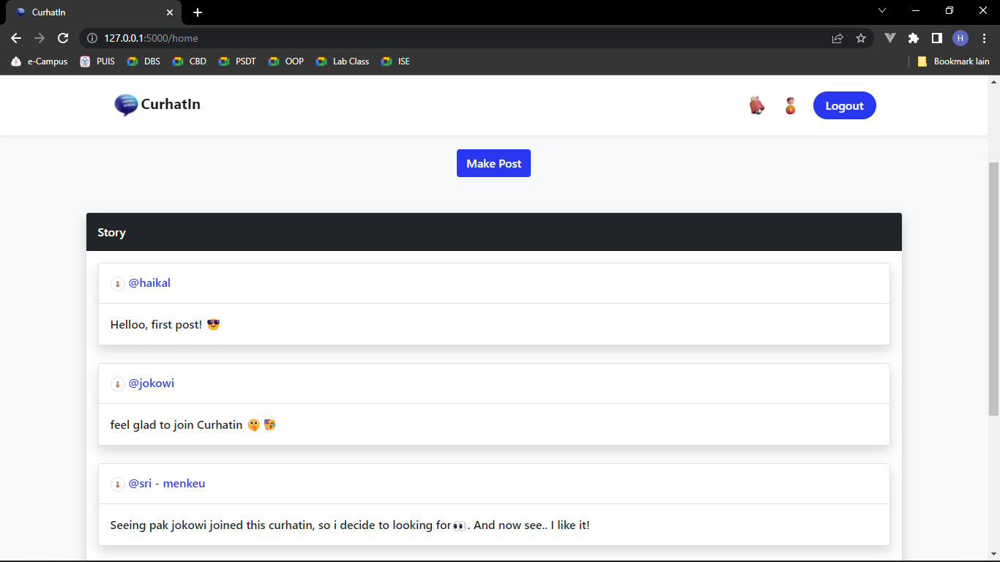

# curhatIn

**CurhatIn is a Social sharing platform that build based on the flask framework. This project was created to fulfill the final project requirement in Psychology and Design Thinking subject.**

CurhatIn is a platform for sharing our thoughts and experiences with others . This app has some fitures such as :

<ul>
  <li>Registration</li>
  <li>Login </li>
  <li>Logout</li>
</ul>

Use basic crud operations like :

<ul>
  <li>Make a post</li>
  <li>Edit post</li>
  <li>Delete post</li>
</ul>

Using peewee which is si ple and light ORM 

And bootstrap as our frontend framework.

**We use SQLite as our database for this project. The schema in our database is as follows:**

<h6>user</h6>
<ul>
<li>id</li>
<li>username</li>
<li>password</li>
<li>email</li>
<li>joint_at</li>
</ul>

<h6>message</h6>
<ul>
<li>id</li>
<li>user_id</li>
<li>content</li>
<li>publihed_at</li>
</ul>

<h6>relationship</h6>
<ul>
<li>id</li>
<li>from_user_id</li>
<li>to_user_id</li>
</ul>

# Display

#### Landing Page

#### Register page

#### Login page

#### Home page

#### Make  and editpost function

##### Profile page

#### followers list page

#### following list page

